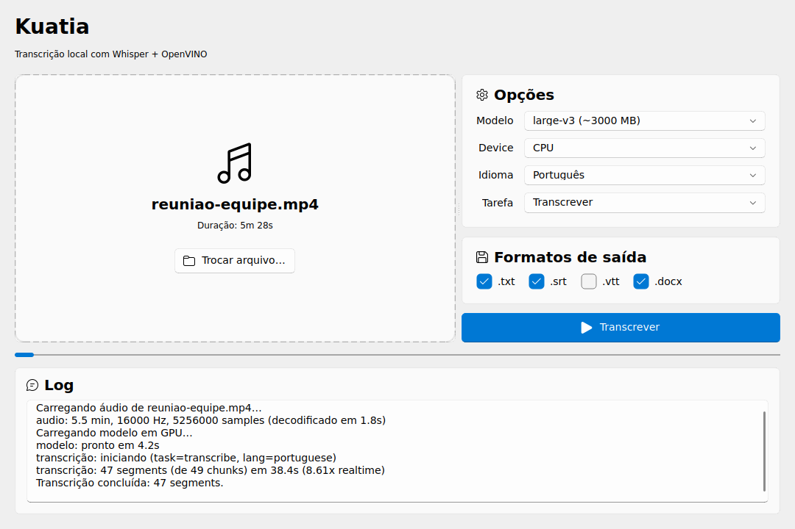
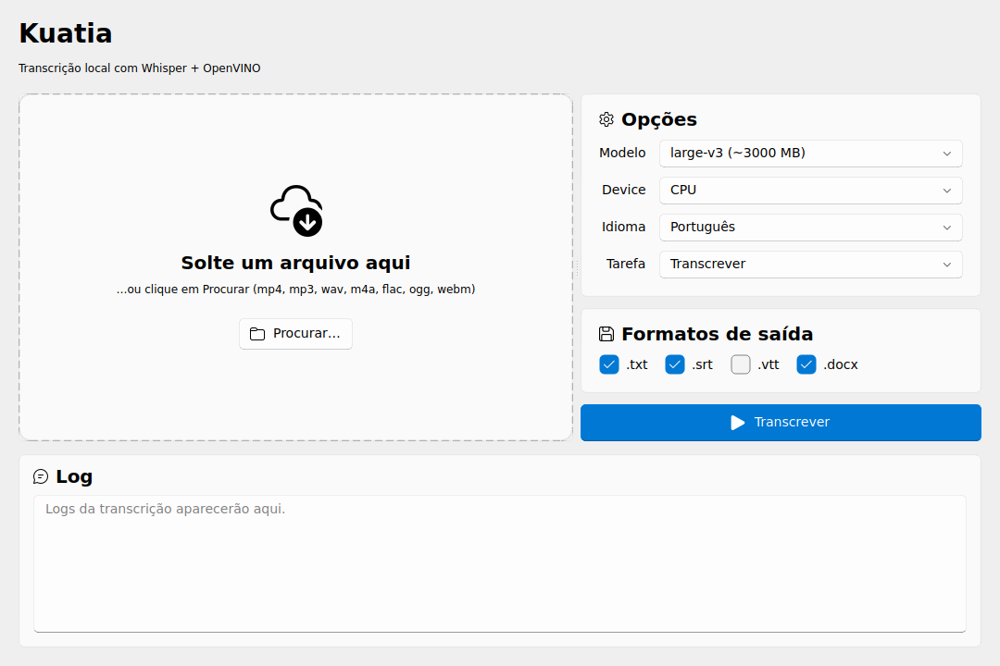
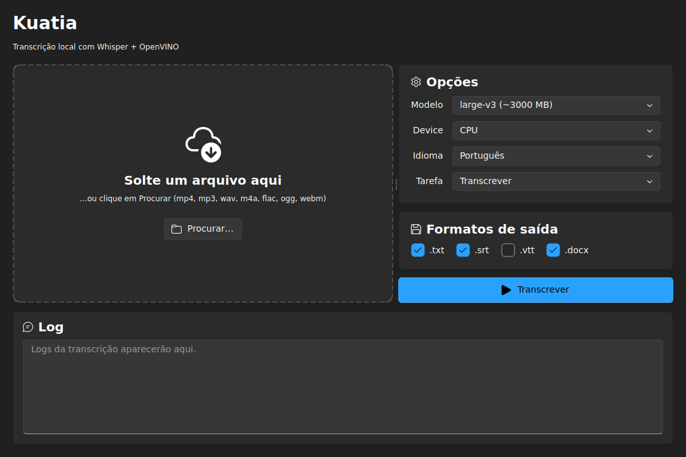
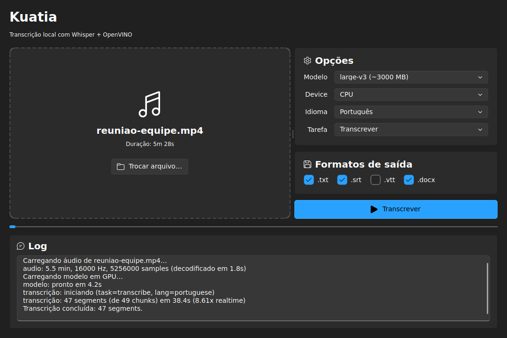
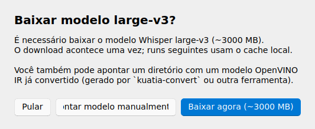

<div align="center">

# Kuatia

**Transcrição local de áudio e vídeo no Windows, com Whisper acelerado por OpenVINO em hardware Intel.**

[](LICENSE)
[](https://www.python.org/downloads/)
[](https://github.com/zhiyiYo/PyQt-Fluent-Widgets)
[](https://huggingface.co/openai/whisper-large-v3)
[](https://docs.openvino.ai/)
[](#-funcionalidades)

<sub>*kuatia* (tupi): papel, escrita, desenho — o que se registra.</sub>



</div>

---

## ✨ O que é

Kuatia transcreve áudio e vídeo na sua máquina, sem mandar nada pra nuvem. Roda
o modelo [Whisper](https://github.com/openai/whisper) (open-source da OpenAI)
acelerado pelo runtime [OpenVINO](https://docs.openvino.ai/) da Intel,
explorando a **iGPU Arc** e o **NPU AI Boost** dos processadores Intel Core Ultra
(Meteor Lake / Lunar Lake / Arrow Lake).

Pensado pra fluxo de trabalho real: arrasta o arquivo na janela, escolhe os
formatos de saída, clica Transcrever. No 1º uso o app baixa o modelo (~3 GB);
em runs seguintes tudo acontece offline.

## 📸 Screenshots

<table>
<tr>
<td align="center" width="50%">
<sub><b>Modo claro</b></sub><br>

</td>
<td align="center" width="50%">
<sub><b>Modo escuro</b></sub><br>

</td>
</tr>
<tr>
<td align="center">
<sub><b>Transcrevendo</b> (progress + log streamando)</sub><br>

</td>
<td align="center">
<sub><b>Diálogo de 1ª execução</b> — download do modelo</sub><br>

</td>
</tr>
</table>

## 🚀 Funcionalidades

- **🔒 100% offline** — após o download inicial do modelo, nada sai da sua máquina.
- **🪟 GUI Fluent Design** — visual nativo Windows 11, dark/light segue o tema do SO.
- **🎯 Drag-and-drop** — arrasta `.mp4`, `.mp3`, `.wav`, `.m4a`, `.flac`, `.ogg`, `.webm`.
- **⚡ Aceleração Intel** — escolhe GPU (Arc iGPU), NPU (AI Boost INT8), CPU ou AUTO.
- **🌐 PT-BR otimizado** — default `whisper-large-v3`, idioma português ou auto-detecção.
- **📤 Export multi-formato** — `.txt` (com timestamps), `.srt`, `.vtt`, `.docx` formatado.
- **🧵 UI não bloqueia** — transcrição em worker thread Qt, com cancelamento.
- **⌨️ CLI também** — `kuatia-transcribe` pra automação e scripts.
- **📦 Distribuição portátil** — `.zip` autocontido, sem instalador.

## 🖥️ Hardware-alvo

Otimizado pra **Intel Core Ultra** (Meteor Lake, Lunar Lake, Arrow Lake) no
**Windows 11** nativo. Outros hardware Intel funcionam via CPU.

| Device | O que é | Quando usar |
|---|---|---|
| `GPU` | Intel Arc iGPU | **Default**. Bom balanço, FP16, suporta qualquer modelo. |
| `NPU` | Intel AI Boost | Mais eficiente em energia. **Exige modelo INT8**. |
| `CPU` | Cores do Ultra | Fallback se driver de GPU falhar. |
| `AUTO` | OpenVINO escolhe | Pra testar rápido. |

> ⚠️ **WSL não funciona** — o passthrough de iGPU/NPU Intel via WSL não é estável.
> Rode no PowerShell nativo do Windows.

## 📥 Instalação

### Opção A — Binário portátil (recomendado para usuários)

1. Vá para a [página de Releases](../../releases/latest) e baixe `kuatia-portable-v<X.Y.Z>.zip`.
2. Descompacte em qualquer pasta.
3. Instale o `ffmpeg` (uma vez):
   ```powershell
   winget install Gyan.FFmpeg
   ```
   Feche e reabra o PowerShell pra refrescar o PATH.
4. Duplo-clique em `kuatia.exe`. No 1º uso, vai aparecer o diálogo de download do modelo.

### Opção B — Do código-fonte (desenvolvimento)

```powershell
# Instalar uv (gerenciador Python moderno)
winget install astral-sh.uv

# Clonar e instalar deps
git clone https://github.com/lucasalbini/kuatia.git
cd kuatia
uv sync

# Rodar a GUI
uv run kuatia-gui

# Ou a CLI
uv run kuatia-transcribe "video.mp4"
```

## ⚡ Quick start

### GUI

1. Abre o `kuatia.exe` (ou `uv run kuatia-gui`).
2. Arrasta um arquivo de áudio/vídeo na janela.
3. Confere as opções (modelo, device, idioma, formatos de saída).
4. Clica **Transcrever**.
5. Quando termina, clica **Abrir pasta de saída** pra ver os arquivos gerados.

### CLI

```powershell
# Default: large-v3 + GPU + português
uv run kuatia-transcribe "reuniao.mp4"

# Modelo menor (mais rápido, qualidade um pouco menor)
uv run kuatia-transcribe "reuniao.mp4" --model medium

# Detectar idioma automaticamente
uv run kuatia-transcribe "audio.mp3" --language auto

# Forçar NPU com modelo INT8 customizado
uv run kuatia-convert --model openai/whisper-large-v3 --out models\large-v3-int8 --int8
uv run kuatia-transcribe "reuniao.mp4" --device NPU --model-dir models\large-v3-int8

# Ver tudo
uv run kuatia-transcribe --help
```

A saída fica no mesmo diretório do input (`.txt` + `.srt` por default).

## 📊 Performance esperada

Valores aproximados para **1 hora de áudio** com modelo `large-v3` em Intel Core Ultra 7 155U:

| Device | Modelo | Tempo de transcrição | Consumo de energia |
|---|---|---|---|
| CPU | FP16 | ~50-70 min | Alto |
| iGPU (Arc) | FP16 | ~8-12 min | Médio |
| NPU | INT8 | ~6-10 min | Baixo |

## 🧰 Modelos suportados

| Nome | HuggingFace ID | Tamanho | Qualidade PT-BR |
|---|---|---|---|
| `large-v3` (default) | `openai/whisper-large-v3` | ~3 GB | ⭐⭐⭐⭐⭐ |
| `medium` | `openai/whisper-medium` | ~1.5 GB | ⭐⭐⭐⭐ |
| `small` | `openai/whisper-small` | ~500 MB | ⭐⭐⭐ |

Cache local em `%LOCALAPPDATA%\kuatia\models\`. Para apontar um modelo customizado
(INT8 NPU, fine-tune próprio, etc.), use `--model-dir` na CLI ou
"Apontar modelo manualmente" no diálogo de 1º uso da GUI.

## 🏗️ Arquitetura

```
src/kuatia/
├── cli.py                 # Entry point CLI (kuatia-transcribe)
├── convert_model.py       # HF → OpenVINO IR (kuatia-convert)
├── core/                  # API pura, reusável pela CLI e GUI
│   ├── audio.py           # Decode via ffmpeg → float32 16 kHz
│   ├── transcriber.py     # Wrapper Whisper + OpenVINO; lazy imports
│   ├── writers.py         # .txt / .srt / .vtt / .docx
│   ├── model_manager.py   # Cache + download HuggingFace
│   └── errors.py          # Exceptions tipadas
└── gui/                   # PySide6 Fluent Design
    ├── app.py             # QApplication + setTheme(Theme.AUTO)
    ├── main_window.py     # Janela principal
    ├── worker.py          # QThread + signals pra transcrição
    ├── download_worker.py # QThread pro download do modelo
    ├── first_run.py       # Diálogo de 1ª execução
    ├── devices.py         # Detecção OpenVINO (CPU/GPU/NPU)
    ├── file_picker.py     # DnD + ffprobe pra duração
    └── output.py          # Export + abrir pasta no SO
```

Decisões de arquitetura registradas em
[`docs/adr/`](docs/adr/). A escolha inicial de stack
(Whisper + OpenVINO + PySide6) está em
[`0001-stack-inicial.md`](docs/adr/0001-stack-inicial.md).

## 🛠️ Desenvolvimento

```powershell
# Lint + format + types + testes
uv run ruff check src tests build
uv run ruff format --check src tests build
uv run mypy src/
uv run pytest

# Cobertura
uv run pytest --cov=src/kuatia/core

# Build do executável Windows
pwsh build\build.ps1
pwsh build\package.ps1   # zipa em dist\kuatia-portable-v<X.Y.Z>.zip
```

Antes de cada release, executar o **checklist de smoke E2E em VM Windows limpa**:
[`docs/release-checklist.md`](docs/release-checklist.md).

## 🐛 Troubleshooting

<details>
<summary><b>"Cannot find OpenCL device" ao usar Device = GPU</b></summary>

Driver Intel Graphics desatualizado. Atualize via Windows Update ou
[Intel Driver & Support Assistant](https://www.intel.com/content/www/us/en/support/detect.html).
Reinicie depois.
</details>

<details>
<summary><b>"NPU plugin not found" ao usar Device = NPU</b></summary>

Falta o
[Intel NPU Driver](https://www.intel.com/content/www/us/en/download/794734/intel-npu-driver-windows.html).
Instale e reinicie. NPU também exige modelo INT8 — converta com
`uv run kuatia-convert --int8`.
</details>

<details>
<summary><b>"ffmpeg não encontrado"</b></summary>

O PATH não pegou o `winget install`. Feche e reabra o PowerShell.
Confirme com `ffmpeg -version`.
</details>

<details>
<summary><b>GUI demora muito pra abrir (> 10s)</b></summary>

Provavelmente é Windows Defender escaneando os DLLs do `.venv` no primeiro load.
Adicione a pasta do projeto como exclusão no Defender, ou rode o app uma vez —
runs seguintes ficam rápidos com o cache do SO.
</details>

<details>
<summary><b>Transcrição com lacunas/repetições</b></summary>

`large-v3` é o melhor modelo em PT-BR mas pode alucinar em trechos de silêncio
prolongado. Corte silêncios > 5s antes, ou use `--language portuguese`
explicitamente em vez de `auto`.
</details>

## 🤝 Contribuindo

Issues e PRs são bem-vindas. Antes de abrir, dá uma olhada nas
[issues abertas](../../issues) — pode ser que o que você quer fazer já esteja
no roadmap.

**Workflow:**
1. Fork → branch a partir de `dev`
2. `uv sync` para instalar deps
3. Escreva testes (PR sem teste é rejeitada)
4. `uv run pytest && uv run ruff check && uv run mypy src/` tudo verde
5. Abre PR contra `dev`

## 📜 Licença

[GPL-3.0-or-later](LICENSE). A dependência `PySide6-Fluent-Widgets` é GPLv3,
o que obriga o projeto inteiro a ser GPL-compatível. Pra uso comercial sob
licença permissiva, é necessário comprar a [licença comercial do
Fluent-Widgets](https://qfluentwidgets.com/pages/pro) e re-licenciar.

## 🙏 Créditos

Kuatia se apoia em projetos open-source incríveis:

- **[OpenAI Whisper](https://github.com/openai/whisper)** — o modelo de
  reconhecimento de fala (MIT).
- **[Intel OpenVINO](https://docs.openvino.ai/)** — runtime de inferência
  pra hardware Intel (Apache 2.0).
- **[HuggingFace Optimum Intel](https://github.com/huggingface/optimum-intel)**
  — ponte transformers ↔ OpenVINO (Apache 2.0).
- **[PySide6](https://doc.qt.io/qtforpython-6/)** — bindings Python do Qt (LGPL).
- **[PyQt-Fluent-Widgets](https://github.com/zhiyiYo/PyQt-Fluent-Widgets)** —
  visual Fluent Design (GPL).
- **[ffmpeg](https://ffmpeg.org/)** — decode universal de áudio/vídeo (LGPL/GPL).
- **[python-docx](https://github.com/python-openxml/python-docx)** —
  geração de `.docx` (MIT).
- **[uv](https://docs.astral.sh/uv/)** — package manager moderno (MIT/Apache).

---

<div align="center">
<sub>Feito com ☕ por <a href="https://github.com/lucasalbini">Lucas Albini</a></sub>
</div>
